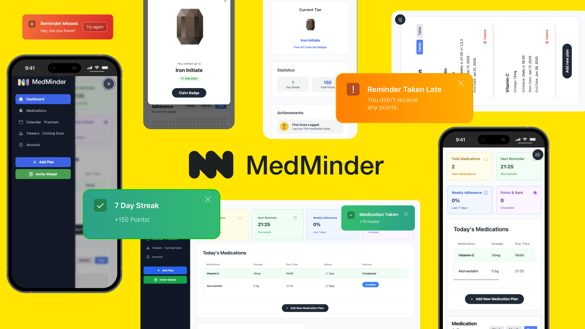

# MedMinder

Medminder is a gamified medical reminder app with timezone specificty and a calendar view 📆

Smart medication tracker built with Django.

[](https://medminder-fhhw.onrender.com)
[](https://medminder-fhhw.onrender.com/documentation/)


[](https://github.com/lukeromburgh/medminder/blob/main/LICENSE)


---

## 📘 Documentation

For detailed API usage, setup instructions, and more, please visit our [Live Documentation](https://medminder-fhhw.onrender.com/documentation/).

[](https://medminder-fhhw.onrender.com/documentation/)

## Table of Contents

[Overview](#-project-overview)

[Access to Wireframes]

[Design](#medminder-design-overview)
  - [The 5 Planes](#-strategy-plane)
    - [Strategy Plane](#-strategy-plane)
    - [Scope Plane](#-scope-plane)
    - [Structure Plane](#-structure-plane)
    - [Skeleton Plane](#-skeleton-plane)
    - [Surface Plane](#-surface-plane)

[User Stories](#medminder-application-user-stories)
  - [Persona 1: The Busy Professional (Elena, 34)](#persona-1-the-busy-professional-elena-34)
  - [Persona 2: The Sandwich Carer (David, 52)](#persona-2-the-sandwich-carer-david-52)
  - [Persona 3: The Newly Diagnosed Teen (Leo, 16)](#persona-3-the-newly-diagnosed-teen-leo-16)
  - [Universal User Stories](#universal-user-stories-applicable-to-all-personas)

[Database Schema and Django Models](#database-schema-and-django-models)
  - [Account](#account-related)
  - [Authentication](#auth-related)
  - [Django](#django-related)
  - [Documentation](#documentation-related)
  - [Reminders](#reminders-related)

[Testing](#testing)
  - [Clean code](#clean-code)
  - [Lighthouse](#lighthouse-accessibility-testing)
  - [Unit Testing](#unit-tests)
      - [URL's](#urls)
      - [VIEWS](#views)

[Deployment and Development](#deployment-and-development)

---

# MedMinder: A Gamified Medication Management Platform

## 🚀 Project Overview

MedMinder is a modern, gamified medication management platform built with Django. It empowers users to take control of their health by providing smart reminders, adherence tracking, and a beautiful calendar view—all tailored to each user’s timezone and schedule.

---

## ✨ Key Features

* **Smart Medication Reminders:** Set up complex schedules (daily, weekly, monthly, or custom), receive reminders via email or SMS, and never miss a dose.
* **Gamified Adherence:** Earn points, streaks, badges, and ranks for consistent medication adherence, making health management engaging and rewarding.
* **Premium Calendar View:** Visualize upcoming and past doses, plan ahead, and see your progress at a glance (premium users only).
* **Family & Accountability (Coming Soon):** Invite family or caregivers to view your progress and provide encouragement.
* **Personalized Analytics:** Get insights and statistics to understand your adherence patterns and improve your routines.
* **Timezone Awareness:** All reminders and logs are timezone-aware, ensuring accuracy for users anywhere in the world.
* **Secure & Scalable:** Built on Django with robust authentication and secure data handling.

---

## 🛠️ Technical Highlights

* **Django Backend:** Modular app structure (`accounts`, `reminders`, `payments`, `core`, etc.) for clean separation of concerns.
* **Stripe Integration:** Handles premium subscriptions and paywall logic for advanced features.
* **Custom Cron Jobs:** Automated background tasks for sending reminders, updating stats, and more.
* **Responsive UI:** Modern, mobile-friendly templates using Tailwind CSS and Alpine.js.
* **Extensible:** Easily add new features, integrations, or notification channels.


---

# Wireframes and design concepts

Please check [here](https://www.figma.com/design/sTxl2pHrnf8gDOPc5BNvZj/Untitled?t=IHXE1nx8XzxMzeSS-1) for a view into my original figma file for the app. It includes interface design, the UX flow of forms, some components, the logo, email template ideas and a custom icon set for the Medminder ranking system.

---

# MedMinder Design Overview

## Design Philosophy

MedMinder’s design is grounded in user needs and business goals:

- **Strategy**: Understanding users and aligning with business objectives.
- **Scope**: Delivering clear features and content.
- **Structure**: Organizing for intuitive use.
- **Skeleton**: Presenting with clarity and ease.
- **Surface**: Wrapping it all in a modern, engaging interface.

## 🧠 User-Centric Design Principles

At MedMinder, design isn't just about looks—it's about crafting seamless, intuitive experiences that empower users to take control of their health. Our philosophy focuses on:

- Understanding user needs  
- Simplifying complex tasks  
- Making medication management engaging and rewarding

## 🌟 Key Design Principles

- **Empathy-Driven**  
  We start with a deep understanding of our users' challenges and motivations, ensuring every feature addresses real needs.

- **Simplicity & Clarity**  
  A clean, uncluttered interface makes navigation easy and intuitive.

- **Engagement & Motivation**  
  Gamification transforms medication adherence from a chore into a rewarding experience.

- **Accessibility & Inclusivity**  
  Designed for users of all ages and abilities.

- **Feedback & Iteration**  
  Continuous user feedback drives our iterative design process.

## 🎨 Visual Design & Branding

MedMinder's visual design reflects clarity, trust, and engagement:

- **Color Palette**  
  Light, calming tones with vibrant accents for interactivity.

- **Typography**  
  Clear, legible fonts for readability and accessibility.

- **Iconography**  
  Intuitive icons that guide users through the app.

- **Responsive Design**  
  Mobile-first and fully responsive for all device sizes.

## 🧭 User Experience (UX) Flow

Our UX flow is designed to be intuitive and engaging across all user journeys:

- **Onboarding**  
  Guided setup to add medications and set reminders easily.

- **Daily Use**  
  Timely reminders, quick logging, and a visual dashboard for adherence tracking.

- **Gamification**  
  Points, badges, and streaks encourage consistency with visual progress feedback.

- **Settings & Customization**  
  Easy management of profiles, notifications, and subscriptions.

---

By focusing on these core design principles and user experiences, **MedMinder** delivers a medication management app that’s not only functional but also enjoyable—ultimately improving health outcomes for our users.

---

# The five planes of design

## 🧭 Strategy Plane

Defining the foundation of MedMinder’s purpose and direction.

### 🎯 User Needs & Business Objectives

The Strategy Plane forms the bedrock of MedMinder—aligning every decision with a clear understanding of our users' needs and our core business objectives. This ensures we are building the right product for the right people, creating a sustainable and impactful business.

---

### 1.1 🧩 User Needs: The "Why"

**Core Problem:**  
Non-adherence to medication is a critical and widespread health issue. The consequences include:

- Decreased quality of life  
- Preventable hospitalizations  
- Emotional and financial strain on users and their families  

Contributing factors: forgetfulness, complex multi-dose schedules, lack of motivation, and poor understanding of treatments.

#### 📌 Primary User Needs

- **Reliability & Simplicity**  
  A dependable, intuitive system that reduces complexity.

- **Motivation & Engagement**  
  Encouragement through positive reinforcement makes habits stick.

- **Information & Insight**  
  Clear, actionable data empowers users and caregivers.

- **Support & Connection**  
  Shared progress and community enhance emotional support.

- **Discretion & Trust**  
  Confidence in privacy and data security is non-negotiable.

---

### 👤 User Personas

#### Persona 1: *"The Busy Professional"* – Elena, 34  
- **Scenario**: Manages a demanding job while taking daily medication for a chronic condition.  
- **Needs**: Discrete, efficient reminders; strong privacy.  
- **Pain Points**: Misses doses due to schedule; finds logging tedious.  
- **MedMinder’s Role**: Persistent reminders and one-tap logging.

---

#### Persona 2: *"The Sandwich Carer"* – David, 52  
- **Scenario**: Cares for his elderly mother with complex medication needs.  
- **Needs**: Centralized dashboard, refill alerts, report sharing.  
- **Pain Points**: Struggles with medication schedules; no adherence visibility.  
- **MedMinder’s Role**: Caregiver accounts, refill alerts, and shareable reports.

---

#### Persona 3: *"The Newly Diagnosed Teen"* – Leo, 16  
- **Scenario**: Adjusting to life with Type 1 Diabetes.  
- **Needs**: Gamification, educational guidance.  
- **Pain Points**: Resistant to routine; finds it disruptive.  
- **MedMinder’s Role**: Engaging experience with achievements and learning support.

---

### 1.2 💼 Business Objectives: The "How"

#### 🧾 Value Proposition

For individuals and caregivers managing medications, **MedMinder** is an **engaging and reliable adherence partner**. Unlike basic alarm apps, we offer:

- Intelligent reminders  
- Motivational feedback  
- Insightful analytics  

Our goal: **Empower users**, improve **health outcomes**, and offer **peace of mind**.

#### 💸 Business Model

MedMinder uses a **freemium subscription model**, balancing accessibility with premium feature monetization.

---

#### 🆓 Free Tier

- Core medication reminders  
- Basic adherence tracking  
- Limited medication history

#### 💎 Premium Tier (Monthly/Annual)

- Advanced analytics & downloadable reports (PDFs)  
- Calendar integration (Google, iCal)  
- Caregiver accounts  
- Refill reminders  
- Advanced gamification & customization  
- Pill ID and drug interaction data

---

This strategic foundation allows MedMinder to serve diverse users with empathy, clarity, and business sustainability.


## 📐 Scope Plane

Defining the functional and content requirements that drive development.

---

### 🧱 Requirements & Structure

The Scope Plane translates our **strategic goals** into a concrete set of **functional** and **content** requirements. It serves as a detailed blueprint guiding MedMinder’s development process.

---

### 2.1 ⚙️ Functional Requirements

Features and interactions defined as **epics**, each with user stories and acceptance criteria.

---

#### 🧑‍💼 Epic 1: User Account & Profile Management  
**Description**: Provides users with a secure and personalized space to manage their information and preferences.

**User Stories**:
- Registration: *"As a new user, I want to sign up easily using my email and a password."*
- Authentication: *"As a returning user, I want to log in securely and have a 'Forgot Password' option."*
- Profile Management: *"As a user, I want to edit my profile information."*

**Acceptance Criteria**:
- Passwords hashed using Argon2 or equivalent
- Email verification required
- Secure session handling
- GDPR compliance

---

#### 💊 Epic 2: Core Medication & Scheduling  
**Description**: Enables users to input medication details and define complex reminder schedules.

**User Stories**:
- Add Medication: *"As a user, I want to add a new medication and specify its dosage."*
- Set Schedule: *"As a user, I want to create various schedule types."*
- Multiple Timings: *"As a user, I want to set multiple reminder times per day."*
- Log Doses: *"As a user, I want to mark a dose as 'Taken' or 'Skipped'."*

**Acceptance Criteria**:
- Support for flexible schedule types
- Time zone localization
- Relational schema for medication-schedule-log

---

#### 🔔 Epic 3: Smart Reminders & Notifications  
**Description**: Sends timely and reliable reminders through various channels.

**User Stories**:
- Push Notifications: *"As a user, I want to receive reminders on time."*
- Snooze Functionality: *"As a user, I want to snooze reminders briefly."*
- Escalation: *"As a user, I want backup notifications if I miss one."*

**Acceptance Criteria**:
- Reliable push delivery
- Celery with Redis for scheduling
- SMS integration via Twilio

---

#### 🏅 Epic 4: Gamification & Engagement  
**Description**: Motivates users with feedback loops and achievements.

**User Stories**:
- Streaks: *"See a 'streak' counter for perfect adherence."*
- Points & Levels: *"Earn points for taking medication on time."*
- Badges: *"Unlock badges for milestones."*

**Acceptance Criteria**:
- Server-side logic for rewards
- Real-time updates
- Custom badge assets

---

#### 💎 Epic 5: Premium Features & Subscription Management  
**Description**: Adds premium functionality for paying users.

**User Stories**:
- Subscription: *"Easily upgrade from within the app."*
- Payment: *"Securely enter payment information."*
- Calendar View: *"See full medication history on a calendar."*
- Management: *"View billing history and cancel anytime."*

**Acceptance Criteria**:
- Full Stripe integration
- Secure key handling and webhooks
- Feature access based on subscription

---

#### 🧑‍🤝‍🧑 Epic 6: Caregiver & Family View *(Planned for v2.0)*  
**Description**: Enables caregivers to monitor user adherence with permission.

**User Stories**:
- Invitation: *"Invite family via email to view adherence data."*
- Caregiver Dashboard: *"Simple view of schedule and history."*
- Missed Dose Alerts: *"Get notified of missed critical doses."*

**Acceptance Criteria**:
- Revocable invitation-based access
- Read-only caregiver roles
- Explicit consent with data privacy compliance

---

### 2.2 🧾 Content Requirements

Defines the types of information to be created and maintained to support a smooth, informative user experience.

---

#### 📘 Onboarding & User Guides
- **Content**: Multi-step tutorial, FAQs
- **Format**: In-app modals and Help section

#### 📊 Adherence Statistics & Visualizations
- **Content**: Charts and logs
- **Format**: Graphs and tables in dashboard

#### 💊 Medication Information *(v1.5 Feature)*
- **Content**: Basic drug data (e.g., side effects)
- **Format**: Pulled from third-party API

#### 📜 Legal & Support Documentation
- **Content**: Privacy policy, terms, support contacts
- **Format**: Static content in Settings and on website

#### 🏆 Gamification Content
- **Content**: Badge names, descriptions, triggers
- **Format**: Text strings and image assets

---

This comprehensive scope ensures that MedMinder delivers **functionality** aligned with **user needs**, **technical feasibility**, and **business objectives**.


## 🧱 Structure Plane

**Information Architecture and Interaction Design of the MedMinder App**

The Structure Plane defines the app’s backbone—how content is organized and how users interact with it. This phase focuses on a logical **Information Architecture (IA)** and intentional **Interaction Design (IxD)** to ensure seamless, goal-driven user experiences.

---

### 3.1 🗺️ Information Architecture (IA)

The IA outlines how MedMinder's content and features are structured. The goal: minimize cognitive load, maximize discoverability, and ensure a consistent, intuitive experience.

#### 🧭 App Sitemap & Hierarchy

The app uses a **primary tab bar navigation**, with logical secondary views branching from each section.

<pre>
/ (Root)
├── Login / Registration Flow (Unauthenticated Users)
├── Onboarding Flow (First-time Users)
├── 1.0 Dashboard (Primary Tab)
│ ├── 1.1 Today's Schedule View
│ ├── 1.2 Adherence Snapshot
│ └── 1.3 Quick Actions
├── 2.0 Reminders (Primary Tab)
│ ├── 2.1 Medication List
│ ├── 2.2 Medication Detail View
│ └── 2.3 Add/Edit Medication Flow
├── 3.0 Calendar (Premium - Primary Tab)
│ ├── 3.1 Monthly View
│ └── 3.2 Daily Detail View
├── 4.0 Analytics (Future Enhancement)
│ ├── 4.1 Adherence Reports
│ ├── 4.2 Streak & Gamification History
│ └── 4.3 Export Functionality
└── 5.0 Settings (Accessed via Account Tab)
├── 5.1 Profile Management
├── 5.2 Notification Preferences
├── 5.3 Subscription Management
├── 5.4 Documentation/Help Center
├── 5.5 Legal
└── 5.6 Logout
</pre>


---

### 3.2 🧩 Interaction Design (IxD)

**Interaction Design** governs how users engage with features, emphasizing clarity, feedback, and frictionless workflows.

---

#### 🔄 Key User Flows

##### ➕ Flow: Adding a New Medication
- **Trigger**: Tap "Add Medication"
- **Step 1**: Enter medication name
- **Step 2**: Choose schedule type and timing (e.g., "Every Day", "Specific Days", "Interval")
- **Step 3**: Set dosage
- **Step 4**: Confirm details
- **Feedback**: Confirmation toast/snackbar (“‘Aspirin’ has been added”), visible update in Reminders list

---

##### ⏰ Flow: Logging a Dose from a Notification
- **Trigger**: Push notification received
- **Action**: Tap "Take Now" directly from notification
- **Feedback**: 
  - Server records dose in background  
  - App icon badge updates  
  - Dashboard immediately reflects status  
- **Principle**: Task completion possible without opening the app

---

##### 💳 Flow: Upgrading to Premium
- **Trigger**: User taps "Upgrade" or accesses a locked feature
- **Step 1**: View paywall screen with benefits and pricing
- **Step 2**: Tap "Upgrade Now" → Stripe Checkout (in-app or web view)
- **Step 3**: See success modal ("Welcome to Premium!")
- **Feedback**: 
  - Features instantly unlocked  
  - "Upgrade" CTAs disappear  

---

#### 🎯 Core Interaction Patterns & Principles

##### ✨ Feedback & Microinteractions
- **State Changes**: Button hover/pressed animations
- **Confirmation Dialogs**: Shown for destructive actions (e.g., delete)
- **Loading Indicators**: Spinners for async operations *(future enhancement)*

##### 🏅 Gamification
- **Streak Counter**: Animated on dashboard
- **Badge Unlocks**: Subtle overlays for achievements; easy to dismiss

##### 🧠 Reducing Cognitive Load
- **Progressive Disclosure**: Show advanced options only when relevant (e.g., interval timing)
- **Clear CTAs**: One primary action per screen (e.g., “Save Reminder”, “Upgrade Now”)
- **Design Consistency**: Consistent use of type, icons, colors, and buttons throughout the UI

---

This structure ensures that **users can achieve their goals quickly and confidently**, while reinforcing MedMinder’s mission to make medication adherence simple, engaging, and effective.

---

## 🦴 Skeleton Plane

**Interface, Navigation, and Information Design of the MedMinder App**

The Skeleton Plane defines the **user interface layout**, **navigation patterns**, and **information design principles** that shape the MedMinder experience. It ensures that users can interact with the app intuitively, efficiently, and confidently.

---

### 🎨 Interface Design

Our design philosophy emphasizes **clarity**, **consistency**, and **responsiveness**. The UI will be developed using **Tailwind CSS**, a utility-first framework that enables:

- Rapid, consistent styling
- Responsive layouts across mobile and desktop
- Seamless theming for light/dark modes *(future enhancement)*

#### 📚 Layout Strategy

- **Persistent Sidebar Navigation** (for tablet & desktop)
  - Quick access to core features: Dashboard, Reminders, Calendar, Analytics, Account
  - Collapsible for smaller viewports
- **Tab Navigation** (for mobile)
  - Simplified bottom tab bar with icon-based labels
- **Floating Action Button (FAB)**: 
  - Prominently placed for primary actions (e.g., “Add Reminder”)

---

### 🧭 Navigation Design

Navigation is designed to be **logical**, **predictable**, and aligned with user mental models.

#### 🗂️ Logical Grouping

- **Reminders**: View, add, edit medications and schedules
- **Calendar** *(Premium)*: Visualize medication history
- **Analytics** *(Future)*: Insights and adherence trends
- **Account**: Profile, subscription, notification preferences, help

#### 📢 Calls-to-Action (CTAs)

Strategic CTA buttons will:
- Direct users to key features (“Add Medication”, “View Calendar”)
- Encourage conversion (“Upgrade to Premium”)
- Promote goal completion (“Complete Onboarding”, “Log Dose”)

CTAs will use **color and contrast** to stand out without disrupting flow.

---

### 🧠 Information Design

Effective information design ensures that **critical content is understood at a glance**, with minimal friction.

#### 🏗️ Visual Hierarchy Tactics

- **Icons**:  
  - Universal symbols (e.g., bell for reminders, star for achievements)  
  - Provide instant recognition, reducing text dependency

- **Color System**:  
  - Primary action: MedMinder Blue  
  - Success: Green (e.g., dose taken)  
  - Warning/Error: Amber/Red (e.g., missed dose)  
  - Neutral tones for structure and background

- **Whitespace & Spacing**:  
  - Generous padding to segment information  
  - Prevents cognitive overload and improves scan-ability  
  - Improves touch targets for accessibility

---

### 🔧 UI Patterns & Microinteractions

- **Modals**: Used for onboarding steps, subscription prompts, and confirmations
- **Toasts/Snackbars**: Display success/error messages (e.g., "Medication added")
- **Tooltips**: Provide inline help without cluttering UI
- **Interactive States**: Hover, focus, active states for all interactive elements

---

### 🧩 Example Component Structures

#### 📋 Medication Card (Reminder List)


## 🎨 Surface Plane

**The final layer—what the user sees, feels, and interacts with.**

The Surface Plane is where all previous layers converge into a seamless, polished, and emotionally resonant user experience. It encompasses the **visual**, **tactile**, and **emotional** elements that shape how users perceive and engage with MedMinder.

---

### ✨ Visual Design

Our visual aesthetic is guided by modern, accessible, and brand-aligned design principles.

#### 🌈 Color Palette

- **Accessibility-first**: Adheres to [WCAG 2.1](https://www.w3.org/WAI/WCAG21/quickref/) AA guidelines for contrast and readability
- **Primary Color**: MedMinder Blue `#0077CC` — conveys trust, reliability
- **Secondary**: Soft lavender, mint, and coral — used for highlights, gamification, and progress
- **Status Colors**:
  - Green: Success (e.g., dose taken)
  - Amber: Warnings (e.g., missed dose)
  - Red: Errors or urgent actions

#### 🅰️ Typography

- **Font Family**: Inter or Roboto (depending on platform)
- **Scale**: Hierarchical system (H1 > H2 > Body > Caption) for clarity and flow
- **Consistency**: All headings, buttons, and body text use uniform sizing and spacing to reduce cognitive strain

#### 🖼️ Iconography

- **Style**: Outline-based, consistent stroke weight
- **Set**: Lucide or Heroicons
- **Function**: Enhances scannability and supports action recognition (e.g., calendar, pill, bell icons)

#### 🧾 Documentation Aesthetic

Inspired by **Stripe’s developer documentation**, our docs include:
- Monospaced, syntax-highlighted code blocks
- Informative callouts (Tips, Warnings, Notes)
- Clear layout with side navigation and section anchors
- Mobile-friendly formatting

---

### 🎛️ Sensory Design

Good design doesn’t just look good — it **feels good**. The app will provide tactile and emotional feedback to build trust and confidence.

#### 🔁 Motion & Animation

- **Page transitions**: Smooth fades and slide-ins between views
- **Microinteractions**:
  - Button tap ripples or bounce effects
  - Progress animations when achieving a goal
- **Gamification Celebrations**:
  - Badge unlocks accompanied by celebratory animations
  - Streak counters animate with visual energy

> **Principle**: Animations enhance engagement, never distract

#### 🪟 Feedback & Control

- **Real-time UI updates**:
  - Dose logs reflected instantly
  - Success/failure toasts on actions (e.g., "Reminder saved ✔️")
- **Tactile Sensation (Mobile)**:
  - Haptic feedback on critical interactions (e.g., logging dose, badge unlock)

---

### 🏅 Gamification Visuals

- **Progress Bars**: Smooth, animated bars showing daily and weekly adherence
- **Badges**:
  - Designed with vibrant gradients and metallic effects
  - Displayed in a dynamic gallery with unlock animations
- **Level-Up Alerts**: Non-intrusive overlays showing progression in points or streaks

---

### 📱 Responsive & Device-Aware

- **Touch Targets**: Optimized for thumb-reach zones on mobile
- **Adaptive Layouts**: Auto-scale for phone, tablet, and desktop
- **Dark Mode (Planned)**: High-contrast theme available for low-light environments

---

By thoughtfully crafting both the **visual clarity** and **emotional feel** of the interface, MedMinder delivers a polished, reassuring experience that builds user confidence, encourages habit formation, and elevates daily health management.


--------


# MedMinder Application: User Stories

This section details the functional requirements of the MedMinder application, presented as user stories from the perspective of key personas. Each story outlines a user's role, their desired action, and the specific benefit derived from that action.

---

## Persona 1: The Busy Professional (Elena, 34)
> Elena requires efficient and private medication management to fit her demanding schedule.

### Account Management & Privacy
* **Sign-Up & Login:** As Elena, I want to securely sign up and log in, so that my personal health data is protected.
* **Notification Control:** As Elena, I want to customize my notification preferences (email, SMS, push), so that reminders integrate seamlessly into my busy day.
* **Secure Logout:** As Elena, I want to quickly log out from any device, so that my privacy is always maintained.

### Medication & Reminder Management
* **Medication Scheduling:** As Elena, I want to easily add medications and set up recurring schedules, so that I consistently take my doses.
* **Discrete Reminders:** As Elena, I want to receive unobtrusive reminders at my chosen times, so that my daily routine is not disrupted.
* **Quick Reminder Actions:** As Elena, I want to snooze or dismiss reminders with a single tap, so that I can manage them efficiently on the go.
* **Effortless Logging:** As Elena, I want to mark a dose as "Taken" or "Skipped" with one click, so that logging my adherence is quick and simple.
* **Dose Overview:** As Elena, I want to view my upcoming and past doses in a calendar format, so that I can effectively plan my medication schedule.

### Motivation & Progress Tracking
* **Adherence Rewards:** As Elena, I want to earn points and badges for consistent medication adherence, so that I feel motivated to maintain my routine.
* **Progress Visualization:** As Elena, I want to track my adherence streak and rank, so that I can easily monitor my long-term progress.

### Data & Insights
* **Simple Analytics:** As Elena, I want to view clear analytics about my medication adherence, so that I can identify patterns and improve my habits.
* **Report Export:** As Elena, I want to download or email my adherence reports, so that I can share them during doctor's appointments.

---

## Persona 2: The Sandwich Carer (David, 52)
> David needs comprehensive tools to manage medication for multiple family members while coordinating care.

### Multi-User & Caregiver Management
* **Dependent Management:** As David, I want to create and manage medication schedules for my mother, so that I can ensure her adherence.
* **Family Coordination:** As David, I want to invite family members to join MedMinder, so that we can collaboratively coordinate care.
* **Centralized Overview:** As David, I want to view all family members’ medication plans and adherence from a central dashboard, so that I have complete visibility of their care.
* **Refill Alerts:** As David, I want to receive notifications when my mother’s medication is low, so that I can reorder in a timely manner.
* **Missed Dose Alerts:** As David, I want to be notified if my mother misses a dose, so that I can follow up with her.
* **Provider Sharing:** As David, I want to share adherence reports with healthcare providers, so that everyone involved in care is well-informed.

### Advanced Reminders & Scheduling
* **Complex Scheduling:** As David, I want to set up intricate medication schedules (e.g., alternating days, multiple times daily), so that my mother’s specific needs are met.
* **Visual Calendar:** As David, I want to see a color-coded calendar for all medications, so that I can quickly identify any scheduling conflicts or gaps.

### Communication & Support
* **In-App Communication:** As David, I want to send encouraging messages or reminders to my mother directly through the app, so that I can provide support.
* **Caregiver Resources:** As David, I want to access educational content about medication management for caregivers, so that I can enhance my caregiving knowledge.

---

## Persona 3: The Newly Diagnosed Teen (Leo, 16)
> Leo seeks an engaging, easy-to-use, and supportive platform to manage his new diagnosis and medication routine.

### Onboarding & Education
* **Intuitive Onboarding:** As Leo, I want a clear, step-by-step onboarding process, so that I can easily understand how to use MedMinder.
* **Accessible Education:** As Leo, I want to access relevant educational content about my condition and medication adherence, so that I feel informed and empowered.

### Gamification & Engagement
* **Rewarding Adherence:** As Leo, I want to earn points, badges, and achievements for taking my medication on time, so that the process feels like a fun game.
* **Visible Progress:** As Leo, I want to see my progress visually (e.g., streaks, levels, leaderboards), so that I stay motivated to continue.
* **Positive Reinforcement:** As Leo, I want to receive positive feedback and encouragement when I reach milestones, so that I feel recognized for my efforts.

### Reminders & Logging
* **Engaging Reminders:** As Leo, I want reminders that are engaging and not intrusive, so that I don't feel annoyed by the routine.
* **Quick Logging:** As Leo, I want to log my doses rapidly, potentially with emojis or quick actions, so that it doesn't feel like a chore.

### Community & Sharing (Optional)
* **Optional Sharing:** As Leo, I want to optionally share my achievements with friends or family, so that I can receive additional encouragement.
* **Group Challenges:** As Leo, I want to participate in challenges or group goals, so that I can experience extra motivation through competition or collaboration.

---

## Universal User Stories (Applicable to All Personas)
> These stories cover core functionalities beneficial to every MedMinder user.

### Calendar & Scheduling
* **Comprehensive Calendar:** As a user, I want to view all my medications and reminders within a calendar, so that I can efficiently plan my week or month.
* **Calendar Filtering:** As a user, I want to filter the calendar by medication, status, or family member, so that I can easily focus on relevant information.
* **Flexible Schedule Management:** As a user, I want to easily edit or delete reminders, so that I can adapt to changes in my schedule.

### Notifications
* **Customizable Delivery:** As a user, I want to choose my preferred reminder delivery method (email, SMS, push) and set quiet hours, so that notifications are received appropriately.
* **Escalation Alerts:** As a user, I want to receive escalation notifications if a dose is missed (e.g., a secondary reminder or alert to a caregiver), so that missed doses are addressed promptly.

### Gamification
* **Dashboard Visibility:** As a user, I want to see my current points, badges, streaks, and rank on my personalized dashboard, so that my progress is always visible.
* **Achievement Unlocks:** As a user, I want to unlock new achievements for consistent adherence, personal improvement, or contributing positively to others, so that I remain engaged.

### Analytics & Reports
* **Adherence Trends:** As a user, I want to view clear trends in my medication adherence over time, so that I can understand my patterns.
* **Data Export:** As a user, I want to easily export or share my adherence data, so that I can communicate my progress with healthcare providers or family members.

### Premium Features
* **Premium Access:** As a user, I want to upgrade to a premium subscription, so that I can access advanced analytics, calendar integrations, and priority support.
* **Subscription Management:** As a user, I want to easily manage my subscription and payment details, so that I have full control over my premium features.


# Database Schema and Django Models

## Account related

```python
from django.db import models


class AccountsReceiveupdates(models.Model):
    id = models.BigAutoField(primary_key=True)
    email = models.CharField(unique=True, max_length=255)
    notifications = models.BooleanField()
    user = models.OneToOneField('AuthUser', models.DO_NOTHING)

    class Meta:
        managed = False
        db_table = 'accounts_receiveupdates'


class AccountsTier(models.Model):
    id = models.BigAutoField(primary_key=True)
    name = models.CharField(unique=True, max_length=50)
    description = models.TextField()
    priority = models.IntegerField()
    is_default = models.BooleanField()
    max_reminders = models.IntegerField(blank=True, null=True)
    max_viewers = models.IntegerField(blank=True, null=True)
    can_use_sms_reminders = models.BooleanField()

    class Meta:
        managed = False
        db_table = 'accounts_tier'


class AccountsUsersettings(models.Model):
    id = models.BigAutoField(primary_key=True)
    receive_email_reminders = models.BooleanField()
    subscription_status = models.CharField(max_length=50)
    payment_customer_id = models.CharField(unique=True, max_length=100, blank=True, null=True)
    payment_subscription_id = models.CharField(unique=True, max_length=100, blank=True, null=True)
    subscription_end_date = models.DateField(blank=True, null=True)
    account_tier = models.ForeignKey(AccountsTier, models.DO_NOTHING, blank=True, null=True)
    user = models.OneToOneField('AuthUser', models.DO_NOTHING)
    receive_sms_reminders = models.BooleanField()
    avatar_bg_color = models.CharField(max_length=50)
    avatar_text_color = models.CharField(max_length=50)
    timezone = models.CharField(max_length=50)

    class Meta:
        managed = False
        db_table = 'accounts_usersettings'

```

## Auth Related

```python

class AuthGroup(models.Model):
    name = models.CharField(unique=True, max_length=150)

    class Meta:
        managed = False
        db_table = 'auth_group'


class AuthGroupPermissions(models.Model):
    id = models.BigAutoField(primary_key=True)
    group = models.ForeignKey(AuthGroup, models.DO_NOTHING)
    permission = models.ForeignKey('AuthPermission', models.DO_NOTHING)

    class Meta:
        managed = False
        db_table = 'auth_group_permissions'
        unique_together = (('group', 'permission'),)


class AuthPermission(models.Model):
    name = models.CharField(max_length=255)
    content_type = models.ForeignKey('DjangoContentType', models.DO_NOTHING)
    codename = models.CharField(max_length=100)

    class Meta:
        managed = False
        db_table = 'auth_permission'
        unique_together = (('content_type', 'codename'),)


class AuthUser(models.Model):
    password = models.CharField(max_length=128)
    last_login = models.DateTimeField(blank=True, null=True)
    is_superuser = models.BooleanField()
    username = models.CharField(unique=True, max_length=150)
    first_name = models.CharField(max_length=150)
    last_name = models.CharField(max_length=150)
    email = models.CharField(max_length=254)
    is_staff = models.BooleanField()
    is_active = models.BooleanField()
    date_joined = models.DateTimeField()

    class Meta:
        managed = False
        db_table = 'auth_user'


class AuthUserGroups(models.Model):
    id = models.BigAutoField(primary_key=True)
    user = models.ForeignKey(AuthUser, models.DO_NOTHING)
    group = models.ForeignKey(AuthGroup, models.DO_NOTHING)

    class Meta:
        managed = False
        db_table = 'auth_user_groups'
        unique_together = (('user', 'group'),)


class AuthUserUserPermissions(models.Model):
    id = models.BigAutoField(primary_key=True)
    user = models.ForeignKey(AuthUser, models.DO_NOTHING)
    permission = models.ForeignKey(AuthPermission, models.DO_NOTHING)

    class Meta:
        managed = False
        db_table = 'auth_user_user_permissions'
        unique_together = (('user', 'permission'),)

```

## Django Related

```python


class DjangoAdminLog(models.Model):
    action_time = models.DateTimeField()
    object_id = models.TextField(blank=True, null=True)
    object_repr = models.CharField(max_length=200)
    action_flag = models.SmallIntegerField()
    change_message = models.TextField()
    content_type = models.ForeignKey('DjangoContentType', models.DO_NOTHING, blank=True, null=True)
    user = models.ForeignKey(AuthUser, models.DO_NOTHING)

    class Meta:
        managed = False
        db_table = 'django_admin_log'


class DjangoContentType(models.Model):
    app_label = models.CharField(max_length=100)
    model = models.CharField(max_length=100)

    class Meta:
        managed = False
        db_table = 'django_content_type'
        unique_together = (('app_label', 'model'),)


class DjangoMigrations(models.Model):
    id = models.BigAutoField(primary_key=True)
    app = models.CharField(max_length=255)
    name = models.CharField(max_length=255)
    applied = models.DateTimeField()

    class Meta:
        managed = False
        db_table = 'django_migrations'


class DjangoSession(models.Model):
    session_key = models.CharField(primary_key=True, max_length=40)
    session_data = models.TextField()
    expire_date = models.DateTimeField()

    class Meta:
        managed = False
        db_table = 'django_session'

```

## Documentation Related

```python


class DocumentationDocscategory(models.Model):
    id = models.BigAutoField(primary_key=True)
    name = models.CharField(max_length=100)
    order = models.IntegerField()

    class Meta:
        managed = False
        db_table = 'documentation_docscategory'


class DocumentationDocstopic(models.Model):
    id = models.BigAutoField(primary_key=True)
    title = models.CharField(max_length=200)
    slug = models.CharField(unique=True, max_length=50)
    content = models.TextField()
    order_in_category = models.IntegerField()
    category = models.ForeignKey(DocumentationDocscategory, models.DO_NOTHING)

    class Meta:
        managed = False
        db_table = 'documentation_docstopic'

```

## Reminders Related


```python


class RemindersDailyreminderlog(models.Model):
    id = models.BigAutoField(primary_key=True)
    due_date = models.DateField()
    due_time = models.TimeField()
    status = models.CharField(max_length=15)
    reminder = models.ForeignKey('RemindersReminder', models.DO_NOTHING)
    user = models.ForeignKey(AuthUser, models.DO_NOTHING)
    is_notified = models.BooleanField()
    action_timestamp = models.DateTimeField(blank=True, null=True)

    class Meta:
        managed = False
        db_table = 'reminders_dailyreminderlog'
        unique_together = (('reminder', 'due_date'),)


class RemindersDosage(models.Model):
    id = models.BigAutoField(primary_key=True)
    dosage = models.CharField(max_length=255)

    class Meta:
        managed = False
        db_table = 'reminders_dosage'


class RemindersMedication(models.Model):
    id = models.BigAutoField(primary_key=True)
    medication_name = models.CharField(max_length=255)

    class Meta:
        managed = False
        db_table = 'reminders_medication'


class RemindersReminder(models.Model):
    id = models.BigAutoField(primary_key=True)
    created_at = models.DateTimeField()
    dosage = models.ForeignKey(RemindersDosage, models.DO_NOTHING)
    medication = models.ForeignKey(RemindersMedication, models.DO_NOTHING)
    user = models.ForeignKey(AuthUser, models.DO_NOTHING)
    schedule = models.ForeignKey('RemindersSchedule', models.DO_NOTHING)
    is_active = models.BooleanField()
    grace_period = models.DurationField()

    class Meta:
        managed = False
        db_table = 'reminders_reminder'


class RemindersReminderstats(models.Model):
    reminder_stat_id = models.AutoField(primary_key=True)
    date = models.DateField()
    completed = models.BooleanField()
    skipped = models.BooleanField()
    completion_time = models.TimeField(blank=True, null=True)
    reminder = models.ForeignKey(RemindersReminder, models.DO_NOTHING)

    class Meta:
        managed = False
        db_table = 'reminders_reminderstats'


class RemindersSchedule(models.Model):
    id = models.BigAutoField(primary_key=True)
    end_date = models.DateField(blank=True, null=True)
    monthly_dates = models.CharField(max_length=100, blank=True, null=True)
    repeat_type = models.CharField(max_length=10)
    start_date = models.DateField()
    time_of_day = models.TimeField()
    weekly_days = models.CharField(max_length=20, blank=True, null=True)

    class Meta:
        managed = False
        db_table = 'reminders_schedule'


class RemindersUserstats(models.Model):
    stat_id = models.AutoField(primary_key=True)
    date = models.DateField()
    reminders_completed = models.IntegerField()
    reminders_skipped = models.IntegerField()
    average_compliance = models.FloatField()
    other_stats = models.JSONField(blank=True, null=True)
    user = models.ForeignKey(AuthUser, models.DO_NOTHING)
    achievement_points = models.IntegerField()
    last_lost_streak_notification_date = models.DateField(blank=True, null=True)
    last_streak_notification_date = models.DateField(blank=True, null=True)
    previous_streak = models.IntegerField()
    last_inactivity_notification_date = models.DateField(blank=True, null=True)

    class Meta:
        managed = False
        db_table = 'reminders_userstats'


class RemindersViewer(models.Model):
    viewer_id = models.AutoField(primary_key=True)
    access_granted_at = models.DateTimeField()
    user = models.ForeignKey(AuthUser, models.DO_NOTHING)
    viewer_user = models.ForeignKey(AuthUser, models.DO_NOTHING, related_name='remindersviewer_viewer_user_set')

    class Meta:
        managed = False
        db_table = 'reminders_viewer'

```


.png>)
.png>)


---
---
---

# Testing

## Clean code

All python files were formatted using Black python formatter

https://pypi.org/project/black/


## Lighthouse Accessibility Testing

### Desktop 

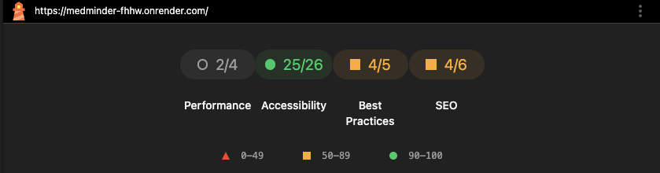
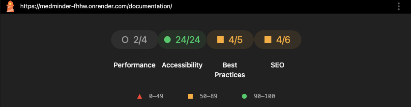
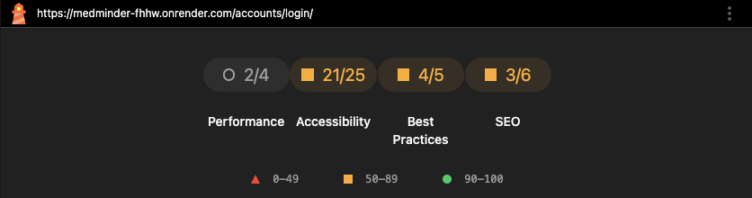
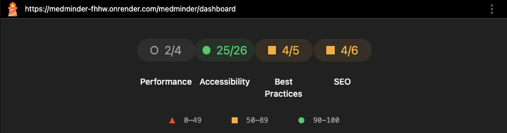
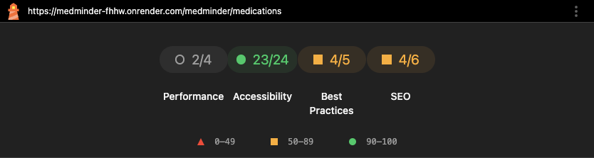
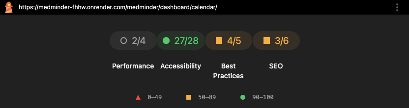

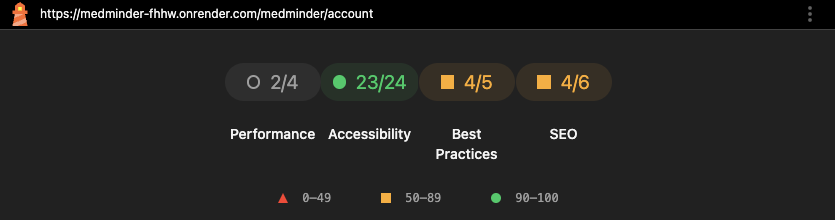

### Mobile

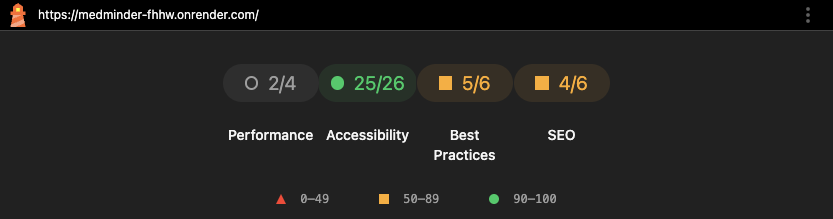
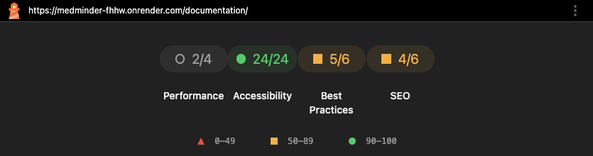

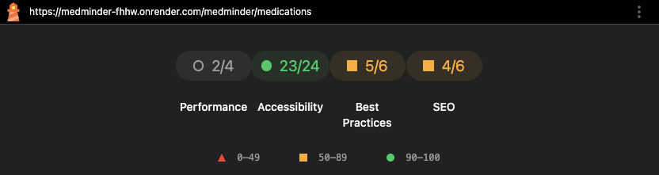
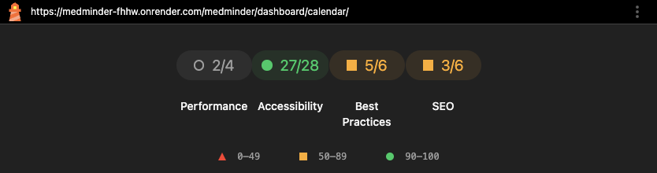

## Unit Tests

I set out to use a DRY approach to unit tests.

All tests were placed in a Tests folder in the project root. The unit tests were seperated in namespaced files like test_url.py and test_views.py.

### URL's

```python

from django.test import TestCase, Client
from django.urls import NoReverseMatch, reverse, resolve
from django.contrib.admin.sites import site as admin_site
from apps.reminders import views as reminders_views
from apps.payments import views as payments_views
from apps.accounts import views as accounts_views


class MainURLTests(TestCase):
    def setUp(self):
        self.client = Client()

    def test_admin_url_resolves(self):
        resolver = resolve("/admin/")
        self.assertEqual(resolver.func.__module__, admin_site.__class__.__module__)

    def test_core_urls(self):
        response = self.client.get("/")
        self.assertIn(response.status_code, [200, 302])

    def test_accounts_urls(self):
        response = self.client.get("/accounts/")
        self.assertIn(response.status_code, [200, 302, 404])

    def test_reminders_urls(self):
        response = self.client.get("/medminder/")
        self.assertIn(response.status_code, [200, 302, 404])

    def test_browser_reload(self):
        response = self.client.get("/__reload__/")
        self.assertIn(response.status_code, [200, 404])

    def test_payments_urls(self):
        response = self.client.get("/payments/")
        self.assertIn(response.status_code, [200, 302, 404])

    def test_documentation_urls(self):
        response = self.client.get("/documentation/")
        self.assertIn(response.status_code, [200, 302, 404])

    def test_all_documentation_urls(self):
        urls = [
            "home",
            "overview",
            "the-why",
            "design-deep-dive",
            "under-the-hood",
            "strategy-plane",
            "scope-plane",
            "structure-plane",
            "skeleton-plane",
            "surface-plane",
            "user-stories",
        ]
        for url_name in urls:
            with self.subTest(url=url_name):
                try:
                    url = reverse(f"documentation:{url_name}")
                    response = self.client.get(url)
                    self.assertIn(
                        response.status_code,
                        [200, 302, 404],
                        msg=f"URL documentation:{url_name} returned {response.status_code}",
                    )
                except NoReverseMatch:
                    self.fail(f"Reverse match failed for documentation:{url_name}")


class MedminderURLTests(TestCase):
    def setUp(self):
        self.client = Client()
        self.dummy_reminder_id = (
            1  # You may need to create a real object depending on your view logic
        )

        self.urls = [
            ("medminder:dashboard", None),
            ("medminder:new_plan", None),
            ("medminder:add_reminder", None),
            ("medminder:reminder_success", None),
            ("medminder:complete_reminder", [self.dummy_reminder_id]),
            ("medminder:medications", None),
            ("medminder:dashboard_calendar", None),
            ("medminder:account_page", None),
            ("medminder:update_user_settings", None),
            ("medminder:manage_plan", None),
            ("medminder:delete_reminder", [self.dummy_reminder_id]),
            ("medminder:viewers", None),
        ]

    def test_all_urls(self):
        for name, args in self.urls:
            with self.subTest(url=name):
                try:
                    url = reverse(name, args=args) if args else reverse(name)
                    response = self.client.get(url)
                    self.assertIn(
                        response.status_code,
                        [200, 302, 403, 404],
                        msg=f"{name} returned {response.status_code}",
                    )
                except NoReverseMatch:
                    self.fail(f"Reverse match failed for {name}")


class PaymentsURLTests(TestCase):
    def setUp(self):
        self.client = Client()
        self.urls = [
            ("payments:create_checkout_session", None),
            ("payments:product_landing_page", None),
            ("payments:payment_success", None),
            ("payments:payment_cancel", None),
            ("payments:stripe_config", None),
            ("payments:stripe-webhook", None),
        ]

    def test_all_payments_urls(self):
        for name, args in self.urls:
            with self.subTest(url=name):
                try:
                    url = reverse(name, args=args) if args else reverse(name)
                    response = self.client.get(url)
                    self.assertIn(
                        response.status_code,
                        [200, 302, 403, 400, 404],
                        msg=f"{name} returned unexpected status code {response.status_code}.",
                    )
                except NoReverseMatch:
                    self.fail(f"Reverse match failed for {name}")


class AccountsURLTests(TestCase):
    def setUp(self):
        self.client = Client()
        self.urls = [
            ("accounts:login", None),
            ("accounts:login_user", None),
            ("accounts:manage_plan", None),
        ]

    def test_accounts_urls(self):
        for name, args in self.urls:
            with self.subTest(url=name):
                try:
                    url = reverse(name, args=args) if args else reverse(name)
                    response = self.client.get(url)
                    self.assertIn(
                        response.status_code,
                        [200, 302, 403, 400, 404],
                        msg=f"{name} returned unexpected status code {response.status_code}.",
                    )
                except NoReverseMatch:
                    self.fail(f"Reverse match failed for {name}")


```

### VIEWS 

```python 

import json
from django.test import TestCase, Client, RequestFactory
from django.urls import reverse
from django.contrib.auth import get_user_model
from apps.accounts.models import ReceiveUpdates
from unittest.mock import patch, MagicMock
from django.http import JsonResponse

from django.utils import timezone
from datetime import time, timedelta, date

from apps.accounts.models import UserSettings, Tier

User = get_user_model()


class CoreViewsTests(TestCase):
    def setUp(self):
        self.client = Client()
        self.user = get_user_model().objects.create_user(
            username="testuser", password="testpass", email="test@example.com"
        )

    def test_landing_page_redirects_authenticated_user(self):
        self.client.login(username="testuser", password="testpass")
        response = self.client.get(reverse("core:home"))
        # Should redirect to LOGIN_REDIRECT_URL or dashboard
        self.assertEqual(response.status_code, 200)

    def test_landing_page_get_anonymous(self):
        response = self.client.get(reverse("core:home"))
        self.assertEqual(response.status_code, 200)
        self.assertTemplateUsed(response, "core/landing_page.html")

    def test_home_post_requires_login(self):
        response = self.client.post(reverse("core:home"), {"email": "anon@example.com"})
        self.assertContains(response, "You must be logged in to sign up for updates.")

    def test_home_post_valid_for_logged_in_user(self):
        self.client.login(username="testuser", password="testpass")
        response = self.client.post(reverse("core:home"), {"email": "test@example.com"})
        # Should redirect after successful signup
        self.assertEqual(response.status_code, 302)
        self.assertTrue(ReceiveUpdates.objects.filter(user=self.user).exists())

    def test_home_post_invalid_email(self):
        self.client.login(username="testuser", password="testpass")
        response = self.client.post(reverse("core:home"), {"email": "not-an-email"})
        self.assertContains(response, "Please enter a valid email address.")


class PaymentViewsTests(TestCase):
    def setUp(self):
        self.client = Client()
        self.user = User.objects.create_user(
            username="testuser", email="test@example.com", password="password"
        )
        self.client.force_login(self.user)

    @patch("stripe.checkout.Session.create")
    def test_create_checkout_session_success(self, mock_create):
        mock_create.return_value.id = "cs_test_123"
        response = self.client.get(reverse("payments:create_checkout_session"))
        self.assertEqual(response.status_code, 200)
        self.assertIn("sessionId", response.json())

    def test_create_checkout_session_invalid_method(self):
        response = self.client.post(reverse("payments:create_checkout_session"))
        self.assertEqual(response.status_code, 200)
        self.assertIn("error", response.json())

    @patch("stripe.checkout.Session.retrieve")
    def test_payment_success_view_with_session(self, mock_retrieve):
        mock_retrieve.return_value = {"customer_details": {"email": "test@example.com"}}
        response = self.client.get(
            reverse("payments:payment_success") + "?session_id=cs_test_123"
        )
        self.assertTemplateUsed(response, "payments/success.html")
        self.assertIn("customer_email", response.context)

    def test_payment_success_view_without_session(self):
        response = self.client.get(reverse("payments:payment_success"))
        self.assertTemplateUsed(response, "payments/success.html")
        self.assertIsNone(response.context["customer_email"])

    def test_payment_cancel_view(self):
        response = self.client.get(reverse("payments:payment_cancel"))
        self.assertTemplateUsed(response, "payments/cancel.html")

    def test_product_landing_page_view(self):
        response = self.client.get("/payments/")
        self.assertTemplateUsed(response, "payments/product_page.html")
        self.assertIn("stripe_publishable_key", response.context)
        self.assertIn("health_hero_price_id", response.context)

    def test_stripe_config_get(self):
        response = self.client.get(reverse("payments:stripe_config"))
        self.assertEqual(response.status_code, 200)
        self.assertIn("publicKey", response.json())


class StripeWebhookTests(TestCase):
    def setUp(self):
        self.client = Client()
        self.user = User.objects.create_user(
            username="testuser", email="test@example.com", password="password"
        )
        self.usersettings, _ = UserSettings.objects.get_or_create(user=self.user)
        self.secret = "whsec_test"

    @patch("stripe.Webhook.construct_event")
    def test_webhook_checkout_session_completed_updates_user(self, mock_construct):
        mock_event = {
            "type": "checkout.session.completed",
            "data": {
                "object": {
                    "customer_details": {"email": self.user.email},
                    "customer": "cus_123",
                    "subscription": "sub_456",
                }
            },
        }
        mock_construct.return_value = mock_event

        response = self.client.post(
            reverse("payments:stripe-webhook"),
            data=json.dumps(mock_event),
            content_type="application/json",
            HTTP_STRIPE_SIGNATURE="dummy_signature",
        )

        self.assertEqual(response.status_code, 200)
        self.usersettings.refresh_from_db()
        self.assertEqual(self.usersettings.subscription_status, "premium")
        self.assertEqual(self.usersettings.payment_customer_id, "cus_123")
        self.assertEqual(self.usersettings.payment_subscription_id, "sub_456")
        self.assertEqual(self.usersettings.account_tier.name, "Premium")

    def test_webhook_without_signature(self):
        response = self.client.post(
            reverse("payments:stripe-webhook"),
            data=json.dumps({"dummy": "data"}),
            content_type="application/json",
        )
        self.assertEqual(response.status_code, 400)

    @patch("stripe.Webhook.construct_event")
    def test_webhook_invalid_event_type(self, mock_construct):
        mock_construct.return_value = {"type": "other.event"}
        response = self.client.post(
            reverse("payments:stripe-webhook"),
            data=json.dumps({}),
            content_type="application/json",
            HTTP_STRIPE_SIGNATURE="dummy_signature",
        )
        self.assertEqual(response.status_code, 200)

    @patch("stripe.Webhook.construct_event", side_effect=ValueError("Invalid payload"))
    def test_webhook_invalid_payload(self, mock_construct):
        response = self.client.post(
            reverse("payments:stripe-webhook"),
            data="invalid json",
            content_type="application/json",
            HTTP_STRIPE_SIGNATURE="dummy_signature",
        )
        self.assertEqual(response.status_code, 400)


class AccountViewsTests(TestCase):

    def setUp(self):
        self.client = Client()
        self.signup_url = reverse("accounts:signup_user")
        self.login_url = reverse("accounts:login_user")
        self.logout_url = reverse("accounts:logout")
        self.signup_page_url = reverse("accounts:signup")
        self.login_page_url = reverse("accounts:login")
        self.manage_plan_url = reverse("accounts:manage_plan")

        self.valid_user_data = {
            "username": "test@example.com",
            "email": "test@example.com",
            "password": "StrongPass123!",  # Single password field
        }

        self.valid_login_data = {
            "username": self.valid_user_data["email"],
            "password": self.valid_user_data["password"],
        }

    def test_signup_page_renders(self):
        response = self.client.get(self.signup_page_url)
        self.assertEqual(response.status_code, 200)
        self.assertTemplateUsed(response, "accounts/signup_page.html")

    def test_login_page_renders(self):
        response = self.client.get(self.login_page_url)
        self.assertEqual(response.status_code, 200)
        self.assertTemplateUsed(response, "accounts/login_page.html")

    def test_manage_plan_redirects(self):
        User.objects.create_user(
            username="testuser",
            email=self.valid_user_data["email"],
            password=self.valid_user_data["password"],
        )
        self.client.login(
            username=self.valid_user_data["email"],
            password=self.valid_user_data["password"],
        )
        response = self.client.get(self.manage_plan_url)
        self.assertEqual(response.status_code, 302)  # Redirect is expected
        # Optional: assert destination URL if you know it
        # self.assertRedirects(response, expected_url)

    def test_signup_user_valid_post(self):
        response = self.client.post(self.signup_url, data=self.valid_user_data)
        self.assertEqual(response.status_code, 200)
        self.assertJSONEqual(
            response.content,
            {"success": True, "redirect": reverse("medminder:dashboard")},
        )
        self.assertTrue(
            User.objects.filter(email=self.valid_user_data["email"]).exists()
        )

    def test_login_user_valid(self):
        User.objects.create_user(
            username=self.valid_user_data["username"],
            email=self.valid_user_data["email"],
            password=self.valid_user_data["password"],
        )
        response = self.client.post(self.login_url, data=self.valid_login_data)
        self.assertEqual(response.status_code, 200)
        self.assertJSONEqual(
            response.content,
            {"success": True, "redirect": reverse("medminder:dashboard")},
        )

    def test_login_user_invalid_credentials(self):
        response = self.client.post(
            self.login_url,
            data={"username": "wrong@example.com", "password": "wrongpass"},
        )
        self.assertEqual(response.status_code, 200)
        json = response.json()
        self.assertFalse(json["success"])
        self.assertIn("errors", json)

    def test_login_user_invalid_form(self):
        response = self.client.post(
            self.login_url, data={"username": "only@example.com"}
        )
        self.assertEqual(response.status_code, 200)
        json = response.json()
        self.assertFalse(json["success"])
        self.assertIn("errors", json)


#  ---------------------------------------------------------------------------------------- #
# ----------------- Reminder Views Tests -----------------#

from apps.reminders.models import (
    Medication,
    Dosage,
    Schedule,
    Reminder,
    DailyReminderLog,
    UserStats,
)
from apps.reminders.views import dashboard_today
from apps.reminders.views import (
    get_user_tier,
    calculate_current_adherence_streak,
)  # Assuming these exist

User = get_user_model()


class DashboardTodayViewTests(TestCase):
    def setUp(self):
        self.factory = RequestFactory()
        self.user = User.objects.create_user(username="testuser", password="pass")
        self.med = Medication.objects.create(medication_name="MedA")
        self.dosage = Dosage.objects.create(dosage="10mg")

        self.today = timezone.localdate()
        self.now = timezone.localtime(timezone.now()).time()

    def create_schedule(self, **kwargs):
        defaults = {
            "repeat_type": "daily",
            "time_of_day": time(9, 0),
            "start_date": self.today - timedelta(days=1),
            "end_date": None,
            "weekly_days": "",
            "monthly_dates": "",
        }
        defaults.update(kwargs)
        return Schedule.objects.create(**defaults)

    def create_reminder(self, schedule, is_active=True):
        return Reminder.objects.create(
            user=self.user,
            medication=self.med,
            dosage=self.dosage,
            schedule=schedule,
            is_active=is_active,
        )

    def make_request(self):
        request = self.factory.get("/dashboard/today/")
        request.user = self.user
        return request

    @patch("django.urls.reverse", return_value="/fake-url/")
    def test_daily_reminder_creates_log(self):
        schedule = self.create_schedule(repeat_type="daily")
        reminder = self.create_reminder(schedule)

        request = self.make_request()
        response = dashboard_today(request)

        self.assertEqual(response.status_code, 200)

        logs = DailyReminderLog.objects.filter(user=self.user, due_date=self.today)
        self.assertTrue(logs.exists())
        self.assertEqual(logs.count(), 1)
        self.assertEqual(logs.first().reminder, reminder)
        self.assertEqual(logs.first().status, "pending")

    @patch("django.urls.reverse", return_value="/fake-url/")
    def test_weekly_reminder_due_today_creates_log(self, mock_reverse):
        # Set weekly_days to include today's weekday
        weekday_str = str(self.today.weekday())
        schedule = self.create_schedule(repeat_type="weekly", weekly_days=weekday_str)
        reminder = self.create_reminder(schedule)

        request = self.make_request()
        dashboard_today(request)

        logs = DailyReminderLog.objects.filter(
            user=self.user, due_date=self.today, reminder=reminder
        )
        self.assertTrue(logs.exists())

    @patch("django.urls.reverse", return_value="/fake-url/")
    def test_weekly_reminder_not_due_today_no_log(self, mock_reverse):
        # weekly_days does not include today's weekday
        other_day = (self.today.weekday() + 1) % 7
        schedule = self.create_schedule(
            repeat_type="weekly", weekly_days=str(other_day)
        )
        reminder = self.create_reminder(schedule)

        request = self.make_request()
        dashboard_today(request)

        logs = DailyReminderLog.objects.filter(
            user=self.user, due_date=self.today, reminder=reminder
        )
        self.assertFalse(logs.exists())

    def test_monthly_reminder_due_today_creates_log(self):
        schedule = self.create_schedule(
            repeat_type="monthly", monthly_dates=str(self.today.day)
        )
        reminder = self.create_reminder(schedule)

        request = self.make_request()
        dashboard_today(request)

        logs = DailyReminderLog.objects.filter(
            user=self.user, due_date=self.today, reminder=reminder
        )
        self.assertTrue(logs.exists())

    def test_monthly_reminder_not_due_today_no_log(self):
        # monthly_dates does not include today
        schedule = self.create_schedule(
            repeat_type="monthly", monthly_dates="1"
        )  # If today is not 1st
        if self.today.day == 1:
            schedule.monthly_dates = "2"
            schedule.save()
        reminder = self.create_reminder(schedule)

        request = self.make_request()
        dashboard_today(request)

        logs = DailyReminderLog.objects.filter(
            user=self.user, due_date=self.today, reminder=reminder
        )
        self.assertFalse(logs.exists())

    def test_reminder_past_end_date_no_log(self):
        schedule = self.create_schedule(end_date=self.today - timedelta(days=1))
        reminder = self.create_reminder(schedule)

        request = self.make_request()
        dashboard_today(request)

        logs = DailyReminderLog.objects.filter(
            user=self.user, due_date=self.today, reminder=reminder
        )
        self.assertFalse(logs.exists())

    def test_reminder_with_invalid_weekly_days_no_log(self):
        schedule = self.create_schedule(repeat_type="weekly", weekly_days="a,b,c")
        reminder = self.create_reminder(schedule)

        request = self.make_request()
        dashboard_today(request)

        logs = DailyReminderLog.objects.filter(
            user=self.user, due_date=self.today, reminder=reminder
        )
        self.assertFalse(logs.exists())

    def test_next_reminder_returns_correct_log(self):
        schedule = self.create_schedule(
            repeat_type="daily",
            time_of_day=(
                timezone.localtime(timezone.now()) + timedelta(hours=1)
            ).time(),
        )
        reminder = self.create_reminder(schedule)

        # Create a DailyReminderLog with due_time after now
        log = DailyReminderLog.objects.create(
            user=self.user,
            reminder=reminder,
            due_date=self.today,
            due_time=schedule.time_of_day,
            status="pending",
        )

        request = self.make_request()
        response = dashboard_today(request)
        self.assertEqual(response.status_code, 200)
        self.assertIn("next_reminder", response.context)
        self.assertEqual(response.context["next_reminder"], log)

    # Add more tests for adherence, achievement points, streak, etc. as needed


```

# Deployment and Development 

# 🛠️ Steps to Deploy on Render

## 1. Push your code to GitHub
Ensure your Django app and `requirements.txt` are committed and pushed to a public or private GitHub repo.

## 2. Create a new Web Service on Render
- Go to your **Render Dashboard**.
- Click "**New Web Service**".
- Connect your GitHub repository.

Fill in the following:

- **Environment**: Python
- **Build Command**:
  ```bash
  pip install -r requirements.txt && npm install && npm run build
  ```
- **Start Command**:
  ```bash
  gunicorn your_project_name.wsgi:application
  ```
  > **Note**: Replace `your_project_name` with the name of your Django project (the folder containing `wsgi.py`).

## 3. Add your Environment Variables
Set the following Render environment variables:

- `DJANGO_SETTINGS_MODULE=your_project_name.settings`
- `SECRET_KEY=your_django_secret_key`
- `DATABASE_URL=your_postgres_url` (Render will auto-inject this if you are using Render PostgreSQL)
- `DEBUG=False`
- `ALLOWED_HOSTS=.onrender.com`
- `EMAIL_HOST`, `EMAIL_HOST_USER`, `EMAIL_HOST_PASSWORD`, etc. (if using an email service like SendGrid)

## 4. Tailwind CSS Integration
Ensure you have Tailwind configured via `postcss.config.js` and `tailwind.config.js`.

Add `npm run build` to your **Build Command** to generate static files. In your `package.json`, you should have a script like this:

```json
"scripts": {
  "build": "tailwindcss -i ./static/src/input.css -o ./static/css/output.css --minify"
}
```

## 5. Static Files
Make sure `collectstatic` is run. You can append it to the **Build Command** if needed:

```bash
python manage.py collectstatic --noinput
```

Use `whitenoise` in your `MIDDLEWARE` to serve static files. In your `settings.py`:
```python
MIDDLEWARE = [
    # ... other middleware
    'whitenoise.middleware.WhiteNoiseMiddleware',
    # ... other middleware
]
```

## 6. Deploy
Render will automatically build and deploy the app after each push to the branch you've connected.

---

## 🧪 Optional: Manual Testing Locally Before Pushing

```bash
# Create and activate a virtual environment
python -m venv venv
source venv/bin/activate

# Install Python dependencies
pip install -r requirements.txt

# Install Node.js dependencies and build Tailwind CSS
npm install
npm run build

# Run database migrations and collect static files
python manage.py migrate
python manage.py collectstatic

# Run the local development server
python manage.py runserver
```

How to test

```bash
python manage.py test
```


---
---

## 📘 Documentation

For detailed API usage, setup instructions, and more, please visit our [Live Documentation](https://medminder-fhhw.onrender.com/documentation/).

[](https://medminder-fhhw.onrender.com/documentation/)
